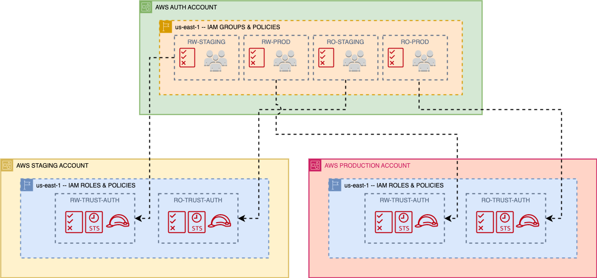

# Central Authorization Account

## This is a prototype for a centralized authorization account to use with multiple AWS accounts.

### The following will be created:
1. The trust roles in both __Prod and Staging__ accounts that specify the Auth account as a trusted account.
2. The Read-Write policies to attach to the trust roles in both __Prod and Staging__. 
3. The Read-Only policies to attach to the trust roles in both __Prod and Staging__.
4. The Read-Write Staging IAM group for the __Auth__ account.
   1. The policy specifying the Read-Write role to assume in the __Staging__ account 
   2. Attach this policy to the Read-Write Staging IAM group in the __Auth__ account.
5. The Read-Only Staging IAM group for the __Auth__ account.
   1. The policy specifying the Read-Only role to assume in the __Staging__ account 
   2. Attach this policy to the Read-Only Staging IAM group in the __Auth__ account.
6. The Read-Write Prod IAM group for the __Auth__ account.
   1. The policy specifying the Read-Write role to assume in the __Prod__ account 
   2. Attach this policy to the Read-Write Prod IAM group in the __Auth__ account.
7. The Read-Only Prod IAM group for the __Auth__ account.
   1. The policy specifying the Read-Only role to assume in the __Prod__ account 
   2. Attach this policy to the Read-Only Prod IAM group in the __Auth__ account.
8. Four IAM test users in the Auth account and place them into the staging and production groups specified for testing purposes.
9. Console access for each user in the auth account. This includes access keys and generated passwords that will be printed out in clear text.

### Reference Diagram

 
It is important to note that policies are attached directly to groups in the auth account that allow
the users to assume the trusted roles in their respective target accounts. These policies __DO NOT__ 
assign privileges in the target accounts, they only specify which role they can assume.  The policies
that assign privileges are attached to the trusted roles in the Staging and Prod accounts.

__NOTE:__  If you have an admin level user in the Auth account and add them into one of these groups,
  they will not be affected by the policies set up in the target accounts and will still have admin
  privileges there!!!

## TODO:
  Refactor to leverage modules
  Add console support for the test users.
